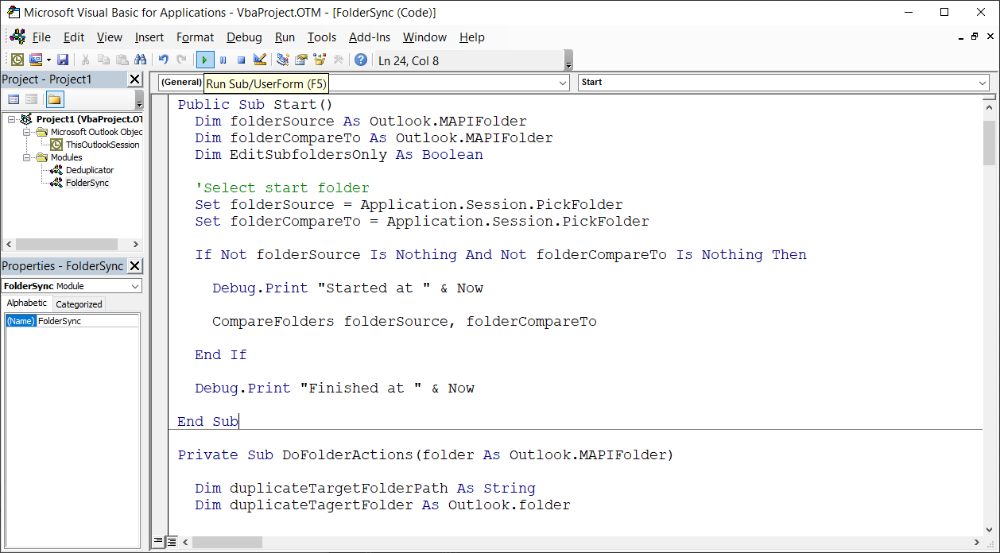
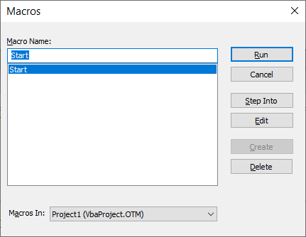
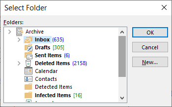

# Outlook Folder Items Sync

This script compares two folders and copies missing items into a dedicated sub-folder

## How to Use

* Paste the content of `main.bas` into  Outlook's VBA editor (See [this general guide](https://www.slipstick.com/developer/how-to-use-outlooks-vba-editor/) and skip the sign stages)
* Run the macro and select the folder you'd like to bring missing items into, and select the second folder you'd like to bring missing items from
* The script will find the missing items and will copy them into a dedicated sub-folders
* The GUI may freeze while the script is running

## Screenshots

### Running the script

